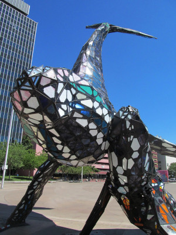
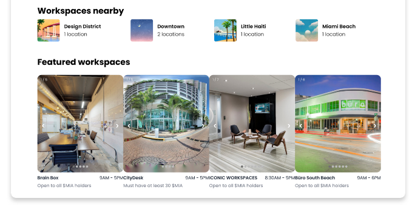
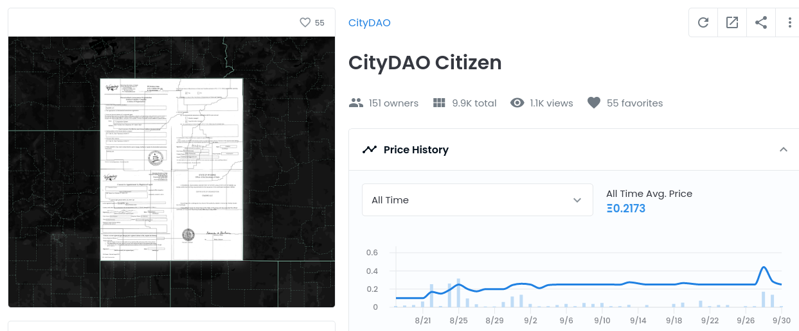
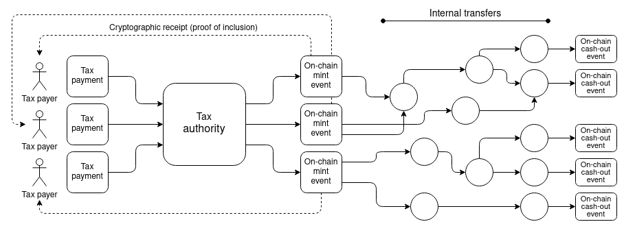

```
Tradução por: Traduza_e_coloque_seu_nome_aqui
Formatação e revisão: Matheus Bach, revise_para_estar_aqui
```
[```ver lista de contribuidores```](/about/#contribuidores)

Crypto Cities 2021 Oct 31 [See all posts](../../../../index.html)  
  
  
# Crypto Cities

_Special thanks to Mr Silly and Tina Zhen for early feedback on the post, and to a big long list of people for discussion of the ideas._

One interesting trend of the last year has been the growth of interest in local government, and in the idea of local governments that have wider variance and do more experimentation. Over the past year, Miami mayor Francis Suarez has pursued a [Twitter-heavy](https://twitter.com/francissuarez/status/1335037068108554241) tech-startup-like strategy of attracting interest in the city, frequently [engaging](https://twitter.com/francissuarez/status/1335037068108554241) with the mainstream [tech industry](https://twitter.com/nedsegal/status/1441431098672644102) and [crypto community](https://twitter.com/FrancisSuarez/status/1443575122875404294) on Twitter. Wyoming now has a [DAO-friendly legal structure](https://www.jdsupra.com/legalnews/crypto-daos-and-the-wyoming-frontier-9251606/), Colorado is [experimenting with quadratic voting](https://www.wired.com/story/colorado-quadratic-voting-experiment/), and we're seeing more and more experiments making more [pedestrian-friendly street environments](https://www.vox.com/the-goods/2019/10/28/20932554/new-york-san-francisco-car-free-zones) for the offline world. We're even seeing projects with varying degrees of radicalness - [Cul de sac](https://culdesac.com/), [Telosa](https://cityoftelosa.com/), [CityDAO](https://www.citydao.io/), [Nkwashi](https://nkwashi.com/), [Prospera](https://prospera.hn/) and many more - trying to create entire neighborhoods and cities from scratch.

Another interesting trend of the last year has been the rapid mainstreaming of crypto ideas such as coins, non-fungible tokens and decentralized autonomous organizations (DAOs). So what would happen if we combine the two trends together? Does it make sense to have a city with a coin, an NFT, a DAO, some record-keeping on-chain for anti-corruption, or even all four? As it turns out, there are already people trying to do just that:

- **[CityCoins.co](https://www.citycoins.co)**, a project that sets up coins intended to become local media of exchange, where a portion of the issuance of the coin goes to the city government. [MiamiCoin](https://www.citycoins.co/miamicoin) already exists, and "San Francisco Coin" appears to be coming soon.
- Other experiments with coin issuance (eg. see [this project in Seoul](https://www.coindesk.com/markets/2018/04/02/south-koreas-capital-is-planning-to-launch-its-own-cryptocurrency))
- **Experiments with NFTs**, often as a way of funding local artists. [Busan](https://level19.notion.site/level19/NFT-Busan-2021-The-NFT-Port-of-Asia-95e9274927024a81aa7e716f1bcfbcf0) is hosting a government-backed conference exploring what they could do with NFTs.
- **Reno mayor Hillary Schieve's [expansive](https://thisisreno.com/2021/04/mayor-schieve-wants-to-save-the-space-whale-by-turning-it-into-an-nft/) vision for [blockchainifying](https://youtube.com/watch?v=uqXW0Kt-RzU) the city**, including [NFT sales](https://mobile.twitter.com/mayorschieve/status/1367926043563094017?lang=en) to support local art, a RenoDAO with RenoCoins issued to local residents that could get revenue from the government renting out properties, blockchain-secured lotteries, blockchain voting and more.
- Much more ambitious projects **creating crypto-oriented cities from scratch**: see [CityDAO](https://www.citydao.io/), which describes itself as, well, "building a city on the Ethereum blockchain" - DAOified governance and all.

But are these projects, in their current form, good ideas? Are there any changes that could make them into _better_ ideas? Let us find out...

## Why should we care about cities?

Many national governments around the world are showing themselves to be inefficient and slow-moving in response to long-running problems and rapid changes in people's underlying needs. In short, many national governments are missing [live players](https://medium.com/@samo.burja/live-versus-dead-players-2b24f6e9eae2). Even worse, many of the outside-the-box political ideas that _are_ being considered or implemented for national governance today are honestly quite terrifying. Do _you_ want the USA to be [taken over by a clone of WW2-era Portuguese dictator Antonio Salazar](https://amgreatness.com/2021/08/01/the-salazar-option/), or perhaps an ["American Caesar"](https://americanmind.org/audio/the-stakes-the-american-monarchy/), to beat down the evil scourge of American leftism? For every idea that can be reasonably described as freedom-expanding or democratic, there are ten that are just different forms of centralized control and walls and universal surveillance.

Now consider local governments. **Cities and states, as we've seen from the examples at the start of this post, are at least in theory capable of genuine dynamism**. There are large and very real differences of culture between cities, so it's easier to find a single city where there is public interest in adopting any particular radical idea than it is to convince an entire country to accept it. There are very real challenges and opportunities in local public goods, urban planning, transportation and many other sectors in the governance of cities that could be addressed. Cities have tightly cohesive internal economies where things like widespread cryptocurrency adoption could realistically independently happen. Furthermore, it's less likely that experiments within cities will lead to terrible outcomes both because cities are regulated by higher-level governments and because cities have an easier escape valve: people who are unhappy with what's going on can more easily exit.

So all in all, it seems like the local level of government is a very undervalued one. And given that [criticism](https://journals.sagepub.com/doi/abs/10.1177/1473095216645631?journalCode=plta) of existing [smart city initiatives](https://en.wikipedia.org/wiki/Smart_city) often heavily focuses on concerns around centralized governance, lack of transparency and [data privacy](https://www.theatlantic.com/technology/archive/2018/11/google-sidewalk-labs/575551/), blockchain and cryptographic technologies seem like a promising key ingredient for a more open and participatory way forward.

## What are city projects up to today?

Quite a lot actually! Each of these experiments is still small scale and largely still trying to find its way around, but they are all at least seeds that could turn into interesting things. Many of the most advanced projects are in the United States, but there is interest across the world; over in Korea the government of Busan is [running an NFT conference](https://level19.notion.site/level19/NFT-Busan-2021-The-NFT-Port-of-Asia-95e9274927024a81aa7e716f1bcfbcf0). Here are a few examples of what is being done today.

### Blockchain experiments in Reno

Reno, Nevada mayor [Hillary Schieve](https://en.wikipedia.org/wiki/Hillary_Schieve) is a blockchain fan, focusing primarily on the Tezos ecosystem, and she has recently been exploring blockchain-related ideas (see [her podcast here](https://youtu.be/uqXW0Kt-RzU)) in the governance of her city:

- **Selling NFTs to fund local art**, starting with an NFT of [the "Space Whale" sculpture](https://thisisreno.com/2021/04/mayor-schieve-wants-to-save-the-space-whale-by-turning-it-into-an-nft/) in the middle of the city
- **Creating a Reno DAO**, governed by Reno coins that Reno residents would be eligible to receive via an airdrop. The Reno DAO could start to get sources of revenue; one [proposed idea](https://youtu.be/uqXW0Kt-RzU?t=904) was the city renting out properties that it owns and the revenue going into a DAO
- **Using blockchains to secure all kinds of processes**: blockchain-secured random number generators for casinos, blockchain-secured [voting](https://vitalik.ca/general/2021/05/25/voting2.html), etc.

  

  

_Reno space whale. [Source here](https://www.flickr.com/photos/rocor/44153615962)._

### CityCoins.co

CityCoins.co is a project built on Stacks, a blockchain run by an unusual "proof of transfer" (for some reason abbreviated PoX and not PoT) [block production algorithm](https://uploads-ssl.webflow.com/5ff21113877dd72b9f913b35/6154471366c15dae30133499_pox.pdf) that is built around the Bitcoin blockchain and ecosystem. 70% of the coin's supply is generated by an ongoing sale mechanism: anyone with STX (the Stacks native token) can send their STX to the city coin contract to generate city coins; the STX revenues are distributed to _existing_ city coin holders who stake their coins. The remaining 30% is made available to the city government.

**CityCoins has made the interesting decision of trying to make an economic model that does not depend on any government support**. The local government does not need to be involved in creating a CityCoins.co coin; a community group can launch a coin by themselves. An [FAQ](https://www.citycoins.co/citycoins-faq)\-provided answer to "What can I do with CityCoins?" includes examples like "CityCoins communities will create apps that use tokens for rewards" and "local businesses can provide discounts or benefits to people who ... stack their CityCoins". In practice, however, the MiamiCoin community is not going at it alone; the Miami government has already [de-facto publicly endorsed it](https://www.coindesk.com/business/2021/09/23/miamicoin-going-mainstream-faster-than-bitcoin-mayor-suarez-says/).

  



_[MiamiCoin hackathon](https://www.citycoins.co/post/announcing-the-winners-of-miamicoin-makers-month) winner: a site that allows coworking spaces to give preferential offers to MiamiCoin holders._

### CityDAO

CityDAO is the most radical of the experiments: Unlike Miami and Reno, which are existing cities with existing infrastructure to be upgraded and people to be convinced, CityDAO a DAO with legal status under the Wyoming [DAO law](https://www.jdsupra.com/legalnews/crypto-daos-and-the-wyoming-frontier-9251606/) (see their docs [here](https://lh3.googleusercontent.com/Dxf308mA8zXr6ZOinvzgOFcydXV9lzE3ALcVswb70V1Ngaers6_PTDio4UVFxUoh91sm2N_h2QCCSS2JSzaE2ufZRjuLeqQsNyeEMw=s0)) trying to create entirely new cities from scratch.

So far, the project is still in its early stages. The team is currently finalizing [a purchase](https://twitter.com/CityDao/status/1442247714729861121) of their first plot of land in a [far-off corner of Wyoming](https://www.google.com/maps/place/44%C2%B055'21.9%22N+109%C2%B015'28.0%22W/@44.9215127,-109.2611115,1702m/data=!3m1!1e3!4m5!3m4!1s0x0:0x0!8m2!3d44.92274!4d-109.25779). The plan is to start with this plot of land, and then add other plots of land in the future, to build cities, governed by a DAO and making heavy use of [radical economic ideas like Harberger taxes](https://podofjake.com/2021/09/15/78-scott-fitsimones/) to allocate the land, make collective decisions and manage resources. Their DAO is one of the progressive few that is [avoiding coin voting governance](https://vitalik.ca/general/2021/08/16/voting3.html); instead, the governance is a voting scheme based on "citizen" NFTs, and ideas have been floated to further limit votes to one-per-person by using [proof-of-humanity verification](https://www.proofofhumanity.id/). The NFTs are currently being sold to crowdfund the project; you can buy them on OpenSea.

  

[](https://opensea.io/assets/0x495f947276749ce646f68ac8c248420045cb7b5e/23487195805935260354348650824724952235377320432154855752878351301067508033245)

[



](https://opensea.io/assets/0x495f947276749ce646f68ac8c248420045cb7b5e/23487195805935260354348650824724952235377320432154855752878351301067508033245)


## What do I think cities could be up to?

Obviously there are a lot of things that cities could do in principle. They could add more bike lanes, they could use [CO2 meters](https://www.abc.net.au/news/health/2021-09-11/covid-transmission-co2-carbon-dioxide-monitor-ventilation-school/100444884) and [far-UVC light](https://www.colorado.edu/today/2021/10/04/specific-uv-light-wavelength-could-offer-low-cost-safe-way-curb-covid-19-spread) to more effectively reduce COVID spread without inconveniencing people, and they could even fund life extension research. But my primary specialty is blockchains and this post is about blockchains, so... let's focus on blockchains.

I would argue that there are two distinct categories of blockchain ideas that make sense:

1.  Using blockchains to create **more trusted, transparent and verifiable versions of existing processes**.
2.  Using blockchains to implement **new and experimental forms of ownership** for land and other scarce assets, as well as **new and experimental forms of democratic governance**.

There's a natural fit between blockchains and both of these categories. Anything happening on a blockchain is very easy to publicly verify, with lots of ready-made freely available tools to help people do that. Any application built on a blockchain can immediately plug in to and interface with other applications in the entire global blockchain ecosystem. Blockchain-based systems are efficient in a way that paper is not, and publicly verifiable in a way that centralized computing systems are not - a necessary combination if you want to, say, make a new form of voting that allows citizens to give high-volume real-time feedback on hundreds or thousands of different issues.

So let's get into the specifics.

### What are some existing processes that blockchains could make more trusted and transparent?

One simple idea that plenty of people, including government officials around the world, have brought up to me on many occasions is the idea of governments creating a whitelisted internal-use-only stablecoin for tracking internal government payments. Every tax payment from an individual or organization could be tied to a publicly visible on-chain record minting that number of coins (if we want individual tax payment quantities to be private, there are [zero-knowledge ways](https://vitalik.ca/general/2021/01/26/snarks.html) to make only the total public but still convince everyone that it was computed correctly). Transfers between departments could be done "in the clear", and the coins would be redeemed only by individual contractors or employees claiming their payments and salaries.

  



  

This system could easily be extended. For example, procurement processes for choosing which bidder wins a government contract could largely be done on-chain.

Many more processes could be made more trustworthy with blockchains:

- **Fair random number generators (eg. for lotteries)** - [VDFs](https://www.youtube.com/watch?v=9-77V1IareQ), such as the one Ethereum is expected to include, could serve as a fair random number generator that could be used to make government-run lotteries more trustworthy. Fair randomness could also be used for many other use cases, such as [sortition](https://en.wikipedia.org/wiki/Sortition) as a form of government.
- **Certificates**, for example cryptographic proofs that some particular individual is a resident of the city, could be done on-chain for added verifiability and security (eg. if such certificates are issued on-chain, it would become obvious if a large number of false certificates are issued). This can be used by all kinds of local-government-issued certificates.
- **Asset registries**, for land and other assets, as well as more complicated forms of property ownership such as development rights. Due to the need for courts to be able to make assignments in exceptional situations, these registries will likely never be fully decentralized bearer instruments in the same way that cryptocurrencies are, but putting records on-chain can still make it easier to see what happened in what order in a dispute.

Eventually, even **voting** could be done on-chain. Here, [many complexities and dragons loom](https://vitalik.ca/general/2021/05/25/voting2.html) and it's really important to be careful; a sophisticated solution combining blockchains, zero knowledge proofs and other cryptography is needed to achieve all the desired privacy and security properties. However, if humanity is ever going to move to electronic voting at all, local government seems like the perfect place to start.

## What are some radical economic and governance experiments that could be interesting?

But in addition to these kinds of blockchain overlays onto things that governments _already_ do, we can also look at blockchains as an opportunity for governments to make completely _new_ and radical experiments in economics and governance. These are not necessarily final ideas on what I think should be done; they are more initial explorations and suggestions for possible directions. Once an experiment starts, real-world feedback is often by far the most useful variable to determine how the experiment should be adjusted in the future.

### Experiment #1: a more comprehensive vision of city tokens

CityCoins.co is one vision for how city tokens could work. But it is far from the only vision. Indeed, the CityCoins.so approach has significant risks, particularly in how economic model is heavily tilted toward early adopters. 70% of the STX revenue from minting new coins is given to _existing stakers of the city coin_. More coins [will be issued](https://docs.citycoins.co/citycoins-core-protocol/issuance-schedule) in the next five years than in the fifty years that follow. It's a good deal for the government in 2021, but what about 2051? Once a government endorses a particular city coin, it becomes difficult for it to change directions in the future. Hence, it's important for city governments to think carefully about these issues, and choose a path that makes sense for the long term.

**Here is a different possible sketch of a narrative of how city tokens might work.** It's far from the _only_ possible alternative to the CityCoins.co vision; see Steve Waldman's [excellent article](https://www.interfluidity.com/v2/7513.html) arguing for a city-localized medium of exchange for yet another possible direction. In any case, city tokens are a wide design space, and there are many different options worth considering. Anyway, here goes...

---

The concept of home ownership in its current form is a notable double-edged sword, and the specific ways in which it's actively encouraged and legally structured is considered by many to be [one of the biggest economic policy mistakes](https://www.economist.com/leaders/2020/01/16/home-ownership-is-the-wests-biggest-economic-policy-mistake) that we are making today. **There is an inevitable political tension between a home as a place to live and a home as an investment asset**, and the pressure to satisfy communities who care about the latter often ends up severely harming the affordability of the former. A resident in a city either owns a home, making them massively over-exposed to land prices and introducing perverse incentives to fight against construction of new homes, or they rent a home, making them _negatively_ exposed to the real estate market and thus putting them economically at odds with the goal of making a city a nice place to live.

But even despite all of these problems, many still find home ownership to be not just a good personal choice, but something worthy of actively subsidizing or socially encouraging. One big reason is that it nudges people to save money and build up their net worth. Another big reason is that despite its flaws, it creates economic alignment between residents and the communities they live in. **But what if we could give people a way to save and create that economic alignment without the flaws?** What if we could create a divisible and fungible city token, that residents could hold as many units of as they can afford or feel comfortable with, and whose value goes up as the city prospers?

First, let's start with some possible objectives. Not all are necessary; a token that accomplishes only three of the five is already a big step forward. But we'll try to hit as many of them as possible:

- **Get sustainable sources of revenue for the government**. The city token economic model should avoid redirecting _existing_ tax revenue; instead, it should find _new_ sources of revenue.
- **Create economic alignment between residents and the city**. This means first of all that the coin itself should clearly become more valuable as the city becomes more attractive. But it also means that the economics should actively encourage _residents_ to hold the coin more than faraway hedge funds.
- **Promote saving and wealth-building**. Home ownership does this: as home owners make mortgage payments, they build up their net worth by default. City tokens could do this too, making it attractive to accumulate coins over time, and even gamifying the experience.
- **Encourage more pro-social activity**, such as positive actions that help the city and more sustainable use of resources.
- **Be egalitarian**. Don't unduly favor wealthy people over poor people (as badly designed economic mechanisms often do accidentally). A token's divisibility, avoiding a sharp binary divide between haves and have-nots, does a lot already, but we can go further, eg. by allocating a large portion of new issuance to residents as a UBI.

One pattern that seems to easily meet the first three objectives is providing benefits to holders: if you hold at least X coins (where X can go up over time), you get some set of services for free. MiamiCoin is trying to encourage businesses to do this, but we could go further and make _government_ services work this way too. One simple example would be making existing public parking spaces only available for free to those who hold at least some number of coins in a locked-up form. This would serve a few goals at the same time:

- Create an **incentive to hold the coin**, sustaining its value.
- Create an **incentive specifically for _residents_ to hold the coin**, as opposed to otherwise-unaligned faraway investors. Furthermore, the incentive's usefulness is capped per-person, so it encourages widely distributed holdings.
- Creates **economic alignment** (city becomes more attractive -> more people want to park -> coins have more value). **Unlike home ownership, this creates alignment with an _entire town_**, and not merely a very specific location in a town.
- **Encourage sustainable use of resources**: it would reduce usage of parking spots (though people without coins who really need them could still pay), supporting many local governments' desires to open up more space on the roads to be more pedestrian-friendly. Alternatively, restaurants could also be allowed to lock up coins through the same mechanism and claim parking spaces to use for outdoor seating.

But to avoid perverse incentives, it's extremely important to avoid overly depending on one specific idea and instead to have a diverse array of possible revenue sources. **One excellent gold mine of places to give city tokens value, and at the same time experiment with novel governance ideas, is zoning**. If you hold at least Y coins, then you can quadratically vote on the fee that nearby landowners have to pay to bypass zoning restrictions. This hybrid market + direct democracy based approach would be much more efficient than current overly cumbersome permitting processes, and the fee itself would be another source of government revenue. More generally, any of the ideas in the next section could be combined with city tokens to give city token holders more places to use them.

### Experiment #2: more radical and participatory forms of governance

This is where [Radical Markets](https://vitalik.ca/general/2018/04/20/radical_markets.html) ideas such as Harberger taxes, [quadratic voting and quadratic funding](https://vitalik.ca/general/2019/12/07/quadratic.html) come in. I already brought up some of these ideas in the section above, but you don't have to have a dedicated city token to do them. Some limited government use of quadratic voting and funding has already happened: see the [Colorado Democratic party](https://www.wired.com/story/colorado-quadratic-voting-experiment/) and the [Taiwanese presidential hackathon](https://presidential-hackathon.taiwan.gov.tw/2020/en/), as well as not-yet-government-backed experiments like Gitcoin's [Boulder Downtown Stimulus](http://web.archive.org/web/20210304144119/https://downtownstimulus.com/). But we could do more!

One obvious place where these ideas can have long-term value is giving developers incentives to improve the **aesthetics of buildings** that they are building (see [here](https://www.bloomberg.com/opinion/articles/2021-10-05/urban-design-why-can-t-we-build-nice-neighborhoods-anymore), [here](https://astralcodexten.substack.com/p/whither-tartaria), [here](https://www.currentaffairs.org/2021/04/when-is-the-revolution-in-architecture-coming) and [here](https://twitter.com/noahpinion/status/1287084300542676992?lang=en) for some recent examples of professional blabbers debating the aesthetics of modern architecture). Harberger taxes and other mechanisms could be used to radically reform **zoning** rules, and blockchains could be used to administer such mechanisms in a more trustworthy and efficient way. Another idea that is more viable in the short term is **subsidizing local businesses**, similar to the Downtown Stimulus but on a larger and more permanent scale. Businesses produce various kinds of positive externalities in their local communities all the time, and those externalities could be more effectively rewarded. **Local news** could be quadratically funded, revitalizing a long-struggling industry. Pricing for **advertisements** could be set based on real-time votes of how much people enjoy looking at each particular ad, encouraging more originality and creativity.

More democratic feedback (and possibly even [retroactive](https://www.youtube.com/watch?v=8rb904_OJj0) democratic feedback!) could plausibly create better incentives in all of these areas. And **21st-century digital democracy through real-time online quadratic voting and funding could plausibly do a much better job than 20th-century democracy, which seems in practice to have been largely characterized by rigid building codes and obstruction at planning and permitting hearings**. And of course, if you're going to use blockchains to secure voting, starting off by doing it with fancy new kinds of votes seems far more safe and politically feasible than re-fitting existing voting systems.

  


_Mandatory solarpunk picture intended to evoke a positive image of what might happen to our cities if real-time quadratic votes could set subsidies and prices for everything._

## Conclusions

There are a lot of worthwhile ideas for cities to experiment with that could be attempted by existing cities or by new cities. New cities of course have the advantage of not having existing residents with existing expectations of how things should be done; but the concept of creating a new city itself is, in modern times, relatively untested. Perhaps the multi-billion-dollar capital pools in the hands of people and projects enthusiastic to try new things could get us over the hump. But even then, existing cities will likely continue to be the place where most people live for the foreseeable future, and existing cities can use these ideas too.

**Blockchains can be very useful in both the more incremental and more radical ideas that were proposed here, even despite the inherently "trusted" nature of a city government.** Running any new or existing mechanism on-chain gives the public an easy ability to verify that everything is following the rules. Public chains are better: the benefits from existing infrastructure for users to independently verify what is going on far outweigh the losses from transaction fees, which are expected to quickly decrease very soon from [rollups](https://vitalik.ca/general/2021/01/05/rollup.html) and [sharding](https://vitalik.ca/general/2021/04/07/sharding.html). If strong privacy is required, blockchains can be combined [zero knowledge cryptography](https://vitalik.ca/general/2021/01/26/snarks.html) to give privacy and security at the same time.

**The main trap that governments should avoid is too quickly sacrificing optionality**. An _existing_ city could fall into this trap by launching a bad city token instead of taking things more slowly and launching a good one. A _new_ city could fall into this trap by selling off too much land, sacrificing the entire upside to a small group of early adopters. Starting with self-contained experiments, and taking things slowly on moves that are truly irreversible, is ideal. But at the same time, it's also important to seize the opportunity in the first place. There's a lot that can and should be improved with cities, and a lot of opportunities; despite the challenges, crypto cities broadly are an idea whose time has come.

---
Fonte: https://vitalik.ca/general/2021/10/31/cities.html