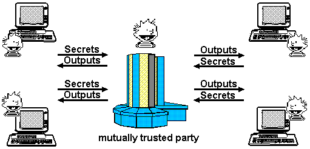
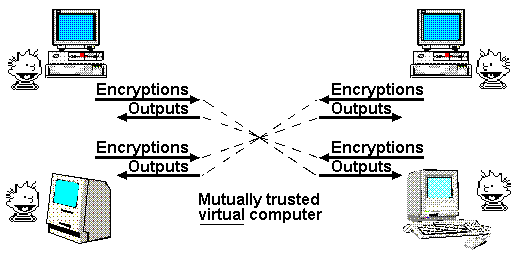

```
Traduzido por: jeffeson
Revisado por: Cypherpunks Brasil
```
### Nick Szabo 

<small>Originalmente publicado em 1997</small> 


===exibe no card daqui pra baixo===

Imagine o protocolo ideal. Teria a terceira parte mais confiável imaginável - uma entidade que está do lado de todo mundo . Todas as partes enviariam suas entradas para Deus. Deus determinaria confiavelmente os resultados e retornaria as saídas. Sendo Deus o supremo na discrição confessional, nenhum partido aprenderia mais sobre entradas das outras partes do que eles poderiam aprender com suas próprias entradas e a saída.

Infelizmente, no nosso mundo temporal lidamos com humanos, em vez de divindades. No entanto, muitas vezes somos obrigados a tratar as pessoas de maneira quase teológica, porque nossa infra-estrutura carece da segurança necessária para nos proteger.

## Terceiro Confiável



Os teóricos de segurança de redes resolveram recentemente esse problema de maneira surpreendente. Eles desenvolveram protocolos que criam máquinas virtuais entre duas ou mais partes. A computação segura multipartidária permite que qualquer número de partes compartilhe uma computação, cada uma aprendendo apenas o que pode ser inferido a partir de suas próprias entradas e da saída da computação. Essas máquinas virtuais têm a interessante propriedade de que as informações de cada parte são altamente confidenciais das outras partes. O programa e a saída são compartilhados pelas partes.

Por exemplo, poderíamos executar uma planilha na Internet neste computador virtual. Concordamos em um conjunto de fórmulas e configuramos o computador virtual com essas fórmulas. Cada participante teria suas próprias células de entrada, que permanecem em branco nos computadores dos outros participantes. Os participantes compartilham célula (s) de saída. Cada entrada com nossos dados privados em nossas células de entrada. Alice só podia aprender tanto sobre as células de entrada dos outros participantes quanto poderia inferir a partir de suas próprias entradas e das células de saída.

## Protocolo Matematicamente Confiável



Existem três grandes limitações. A primeira é que esse computador virtual é muito lento: em alguns casos, um cálculo aritmético por mensagem de rede. Atualmente, ele é, na melhor das hipóteses, prático apenas para lógica pequena ou cálculos aritméticos usados como complemento ou componente de cálculos e protocolos mais eficientes.

A segunda é que existe uma troca entre privacidade, equidade e tolerância a falhas. Equidade significa que todos aprendem os resultados de tal forma que ninguém pode obter vantagem aprendendo primeiro. A tolerância a falhas pode fornecer robustez contra uma minoria, de modo que é necessária uma maioria para interromper o protocolo ou pode não ser robusto, mas usando fail-stop (sistema com paragem segura), de modo que um único participante possa encerrar o protocolo. Muitos artigos discutiram a fração de partes em que alguém deve confiar para ter certeza de que aprenderá a saída correta. Nos resultados tradicionais, a equidade e a privacidade não poderiam ser alcançadas com uma maioria defeituosa. Artigos<sup>[[3]](#fn3) [[4]](#fn4) [[5]](#fn5) [[6]](#fn6)</sup> recentes produziram protocolos justos e privados, mesmo com maiorias falhas. Eles negociam robustez para privacidade e justiça contra qualquer proporção de partes defeituosas. A vantagem dessa abordagem fail-stop é que normalmente é possível encontrar novos parceiros e começar tudo de novo, mas não se quer sofrer perdas irreversíveis, como vazamento de informações, ficar segurando a bolsa ou estar convencido de um resultado incorreto.

A terceira limitação é que, longe de ser onisciente ou onipotente, o protocolo realizará apenas o que está especificado no algoritmo e nas entradas. Ele não poderá substituir terceiros confiáveis onde essas partes fornecem informações ou conhecimentos que não podem ser fornecidos por um computador.

Com essas ressalvas, qualquer intermediário algorítmico pode, em princípio, ser substituído por um computador virtual confiável. Na prática, por causa das três complicações, geralmente construímos protocolos mais limitados a partir de elementos mais eficientes.

A teoria da computação multipartidária, ao possibilitar a intermediação virtual privada, tem implicações importantes, em teoria, para todos os tipos de relações contratuais. Isso pode ser visto mais claramente na área de negociações. Um "mecanismo" na economia é um modelo abstrato de uma instituição que se comunica com seus participantes via mensagens e cujas regras podem ser especificadas por algoritmos. Essas instituições podem ser leilões, trocas, votação e assim por diante. Eles normalmente implementam algum tipo de negociação ou processo de tomada de decisão.

Economistas assumem que um intermediário de confiança opera o mecanismo. Aqui está um exemplo simples de usar este computador virtual para um mecanismo. Alice pode enviar um preço de compra, e Bob um preço de venda, depois seus programas virtuais compartilhados têm uma instrução, "A maior que B?". O computador retorna "true" se o lance de Alice for maior que a oferta de Bob. Um computador um pouco mais sofisticado pode então decidir o preço de acordo com um número de diferentes algoritmos (oferta de Alice, preço de venda de Bob, divisão da diferença, etc.) Isso implementa o mecanismo "negociação cega" ("blind bargaining") sem intermediário confiável.

Em princípio, como qualquer problema computável pode ser resolvido neste computador virtual (são "máquinas de Turing completas"), qualquer mecanismo econômico computável pode ser implementado sem um intermediário confiável. Na prática, enfrentamos as três limitações discutidas acima. Mas a prova da existência, de que qualquer mecanismo econômico pode ser executado sem um intermediário confiável, é muito emocionante. Isso significa que, em princípio, qualquer contrato que possa ser negociado por meio de um terceiro confiável (como um leilão ou troca) pode ser negociado diretamente. Assim, em algum sentido abstrato, os únicos problemas "difíceis" nas negociações de contratos inteligentes são (a) problemas considerados difíceis mesmo com um intermediário confiável (pelas razões econômicas padrão), e (b) a tarefa de especificar algoritmicamente as regras de negociação e termos do contrato de saída (Isso inclui casos em que um intermediário adiciona conhecimento indisponível aos participantes, como um advogado dando conselhos sobre como redigir um contrato). Na prática, muitos problemas que podem ser resolvidos em princípio com computação multipartidária ressurgirão quando implementarmos protocolos de maneira eficiente e prática. Os Protocolos de Deus nos dão um alvo para atirar.

A aplicação desse tipo de análise à fase de desempenho dos contratos é menos direta. Para começar, as teorias econômicas da fase de desempenho não são tão bem desenvolvidas ou simples quanto a teoria do mecanismo das negociações. De fato, a maior parte da teoria econômica simplesmente assume que todos os contratos podem ser feitos perfeitamente e sem custos impostos. Parte da literatura sobre "custos de transação" começou a ir além dessa hipótese, mas há poucos resultados convincentes ou teorias de consenso na área de técnicas e custos de execução de contratos.

A análise da fase de desempenho com a teoria de computação segura multipartidária parece se aplicar apenas aos contratos que podem ser executados dentro do computador virtual. Mas o uso de registros de auditoria pós-inutilizáveis, combinado com a execução de protocolos de auditoria dentro do computador virtual compartilhado, permite que uma ampla variedade de performances fora do computador virtual seja pelo menos observada e verificada por arbitradores selecionados, embora não seja auto-aplicada de forma proativa.

Os participantes deste protocolo de auditoria mutuamente confidencial podem verificar se os livros correspondem aos detalhes das transações armazenadas em um log de transações previamente confirmado e se os números se somam corretamente. Os participantes podem calcular estatísticas resumidas em seus registros de transação compartilhados confidencialmente, incluindo a verificação cruzada dos registros em relação às contrapartes em uma transação, sem revelar esses registros. Eles só aprendem o que pode ser inferido das estatísticas, não podem ver os detalhes das transações. Outra possibilidade intrigante é que o computador virtual possa manter o estado por longos períodos de tempo, permitindo formas sofisticadas de crédito garantido e auto-imposto.

Se a auditoria mutuamente confidencial se tornar prática, poderemos obter alta confiança na factualidade das declarações e relatórios das contrapartes, sem revelar informações de identificação e outras informações detalhadas das transações subjacentes a esses relatórios. Isso forneceria a base para sólidos sistemas de reputação e outros sistemas confiáveis de terceiros, que mantêm a integridade ao longo do tempo, as comunicações, a sumarização e preservam a confidencialidade dos participantes da transação. Sabendo que a auditoria mutuamente confidencial pode ser realizada em princípio, esperamos que nos leve a soluções práticas para esses problemas importantes.

<div class="references">

## References

1.  D. Chaum, C. Crépeau, and I. Damgaard, Multiparty unconditionally secure protocols; In 19th Symp. on Theory of Computing, pages 11-19\. ACM, 1988.

2.  "The Spymasters Double Agent Problem: Multiparty Computations Secure Unconditionally from Minorities and Cryptographically from Majorities," D. Chaum, Advances in Cryptology CRYPTO'89, G. Brassard (Ed.), Springer-Verlag, pp. 591-601.

3.  C. Crépeau, J. van de Graaf, and A. Tapp, Committed Oblivious Transfer and Private Multi-Party Computations; Advances in Cryptology: Proceedings of Crypto '95, Springer-Verlag, pages 110-123, 1995. [↩](#ref3)

4.  Complete Characterization of Adversaries Tolerable in Secure Multi-Party Computation, Martin Hirt and Ueli Maurer. Computer Science Department, ETH Zürich. 1997\. in Proceedings of PODC '97 [↩](#ref4)

5.  Matthias Fitzi, Martin Hirt, and Ueli Maurer: Trading correctness for privacy in unconditional multi-party computation. In Advances in Cryptology — CRYPTO '98, volume 1462 of Lecture Notes in Computer Science, 1998. [↩](#ref5)

6.  R. Cramer, I. Damgaard, S. Dziembowski, M. Hirt, T. Rabin, Efficient Multi-Party Computations with Dishonest Majority, Proceedings of Eurocrypt '99, Springer Verlag LNCS, to appear (May '99). [↩](#ref6)

</div>


Por favor, envie seus comentários para nszabo (at) law (dot) gwu (dot) edu  

Copyright © 1997-1999 por Nick Szabo  
Permissão para redistribuir sem alteração por este concedida

  Fonte:
  [https://nakamotoinstitute.org/the-god-protocols/](https://nakamotoinstitute.org/the-god-protocols/)
