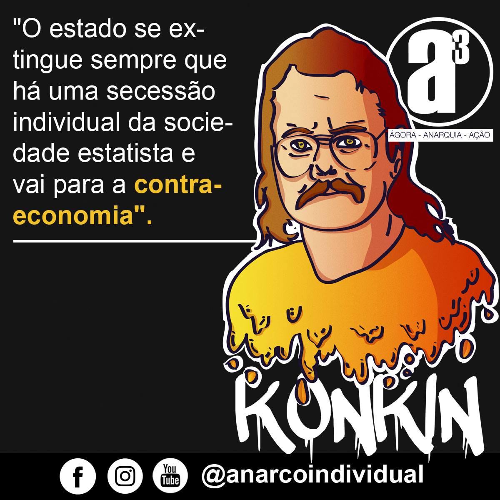

```
Revisado por: Vinicius Yaunner
```
[```ver lista de contribuidores```](/about/#contribuidores)


## Herman Shäd



===exibe no card daqui pra baixo===


Samuel Edward Konkin III, Um Social-Libertário/Libertário de Esquerda nasceu em 1947 na província canadense de Saskatchewan. Konkin desenvolveu uma filosofia política que chamou de agorismo e escreveu três livros defendendo sua ideia, sendo O Manifesto do Novo Libertário sua principal obra. O termo foi usado pela primeira vez no livro An Agorist Primer, do autor mencionado, e deriva da palavra grega “ágora”, que era um local aberto para assembleias e mercado nas antigas cidades-estados gregas. O agorismo é uma vertente do anarquismo de mercado, mas com influências do anarquismo individualista americano e do mutualismo, e se distingue do anarco capitalismo de Rothbard por aceitar a ideia de ocupação e uso, por ter uma diferente visão da legitimidade da propriedade e por ser contra a propriedade intelectual.

O agorismo seria uma anarquia de livre mercado anticapitalista. Mas anticapitalista na definição mutualista do capitalismo, diferente da definição rothbardiana do termo, reconhecendo também as diferenças terminológicas do termo “propriedade” entre Proudhon e Rothbard. Uma das principais diferenças entre a visão de Rothbard e a de Konkin está na questão da legitimidade da propriedade privada, particularmente da terra, em que o agorismo defende que a propriedade desta é apenas legítima enquanto houver a possibilidade de que seu proprietário faça uso dela, desta forma evitando que seja considerada abandonada.

Para se chegar ao agorismo (ou qualquer ideia de anarquia de mercado), Neil J. Schulman, outro teórico libertário e amigo de Konkin, defende a contra-economia, definida como a prática de trocas voluntárias proibidas pelo Estado, como sonegação de impostos, contrabando, tráfico, contratação de imigrantes ilegais, evasão fiscal, dentre outras coisas.

Konkin se opunha ao voto e a todo o sistema político, incluindo o Partido “Libertário”, por considerar a política ilegítima e tentativas de mudança por dentro de sistemas inviáveis e insustentáveis. Acreditava que apenas conseguiríamos acabar com o Estado se houvesse total deslegitimação de suas instituições e de seus agentes por parte suficiente da população.

Talvez a mais revolucionária das vertentes da anarquia de mercado, o agorismo defende a sabotagem contra as instituições estatais, o ataque sistemático(considerado legítima defesa) contra os agentes de manutenção do Estado (políticos e membros do aparato coercitivo), boicote às empresas corporativistas, desobediência civil e prática da contra-economia para burlar as restrições e regulamentações estatais, o que faria o Estado se tornar insustentável e ruir, retirando também todos os incentivos que alguém teria para querer mantê-lo.
