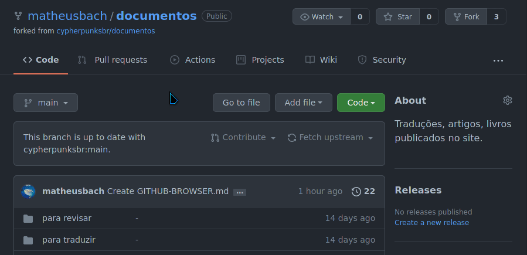
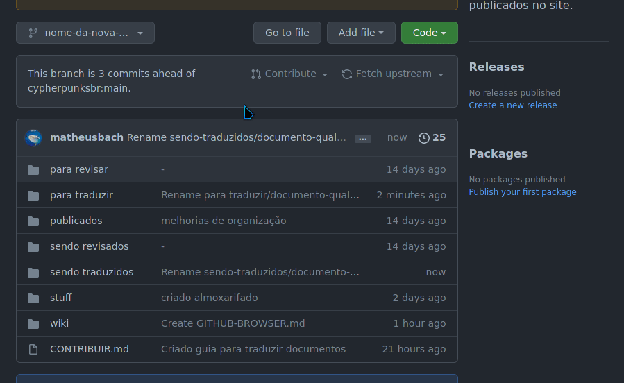
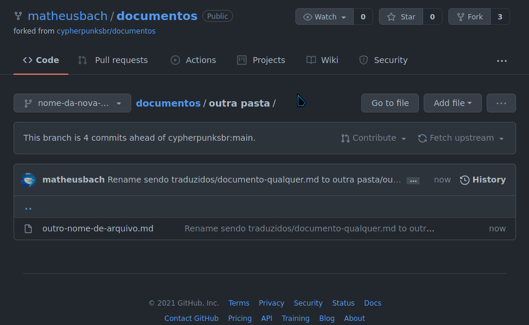
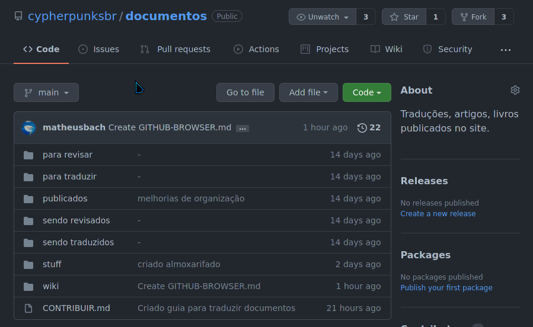

[```ver lista de contribuidores```](/about/#contribuidores)

# Tutorial de uso do Github via website 

## Fluxo básico de contribuição
No Github você só pode alterar projetos que você mesmo tenha criado, ou seja, somente os repositórios que estiverem em ```github.com/seu-nome-de-usuário/nome-do-seu-projeto``` poderão ser alterados diretamente por você. De qualquer forma, isso não te impede de enviar contribuições para projetos criados por outras pessoas. Por exemplo, para contribuir com o nosso projeto, em vez de ir até o repositório original ```github.com/cypherpunksbr/documentos```, você precisará:

 - Fazer uma cópia ([Fork]) desse repositório
  > Após o [Fork], você terá uma cópia exata do repositório original ```github.com/cypherpunksbr/documentos``` que estará em ```github.com/seu-nome-de-usuário/documentos```

 - Criar uma "área de trabalho" ([Branch]) para fazer suas alterações

 - Fazer as alterações **na sua cópia** ```github.com/seu-nome-de-usuário/documentos``` e **dentro da branch** criada no passo anterior

 - "Enviar" suas alterações através de uma [Pull Request (PR)]

A seguir você encontra um tutorial de como executar cada um desses passos diretamente pelo site do Github.
> Este tutorial foi desenvolvido com base na [documentação oficial do Github]. Você pode encontrar mais informações lá.

## Índice
  - [Criando um fork]
  - [Criando uma nova Branch]
  - [Renomeando e movendo arquivos]
  - [Criando um Pull Request]
  - [Abrindo uma Issue]

---

## Criando um fork

- Dentro do repositório do qual você deseja criar uma cópia, no canto superior direito, clique em ```Fork```


- Você será redirecionado para a cópia que acabou de criar ```github.com/seu-nome-de-usuário/documentos```

---

## Criando uma nova Branch

- Dentro da sua cópia (```Fork```) há um atalho que serve para facilitar o gerenciamento de todas as branchs existentes neste repositório. Clique nele para criar uma nova ```Branch```

- Digite um nome para sua nova branch e em seguida clique em ```criar branch: nome-da-branch```



> Você pode navegar de uma branch para outra usando este mesmo atalho. Todas as branchs do repositório estarão listadas lá.
---

## Renomeando e movendo arquivos

- Navegue até o arquivo que deseja mover
- No canto superior direito da exibição do arquivo, clique no lápis :pencil2: para abrir o editor de arquivos
- Para alterar o nome do arquivo basta ir na barra superior e editar o nome



- Para mover o arquivo para uma subpasta, digite o nome da pasta desejada, seguido por ```/```. Sua nova pasta é um novo item na navegação estrutural
- Para mover o arquivo para um diretório acima da localização atual do arquivo, coloque o cursor no início do campo ```nome do arquivo``` e digite ```../``` para pular um nível de diretório inteiro ou pressione a tecla backspace para editar o nome da pasta principal

---

## Criando um Pull Request

- Vá ao repositório e acesse a aba ```Pull requests```
- Clique em ```Nova Pull Request```
- Selecione seu ```Fork``` e sua ```Branch``` que deseja incuir no repositório raiz, conforme o exemplo da GIF
- Coloque um título e uma descrição para manter as coisas organizadas
- Confirme a criação do Pull Request pelo botão 



---

## Abrindo uma Issue

- Vá ao repositório e acesse a aba ```Issues```
- Clique em ```Nova Issue```
- Coloque um título e uma descrição sobre sua contribuição, dúvida, etc.
- Confirme o envio da Issue pelo botão 



[Branch]:                          #criando-uma-nova-branch
[Fork]:                            #criando-um-fork
[Pull Request (PR)]:               #criando-um-pull-request
[documentação oficial do Github]:  https://docs.github.com/en/repositories/working-with-files
[Criando um fork]:                 #criando-um-fork
[Criando uma nova Branch]:         #criando-uma-nova-branch
[Renomeando e movendo arquivos]:   #renomeando-e-movendo-arquivos
[Criando um Pull Request]:         #criando-um-pull-request
[Abrindo uma Issue]:               #abrindo-uma-issue
